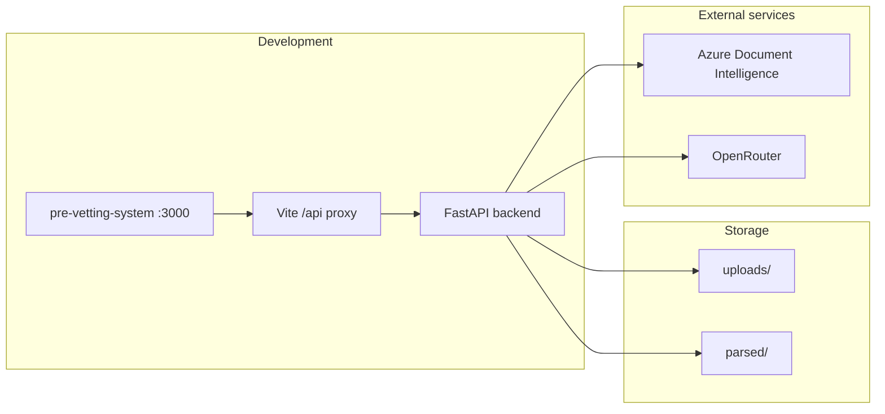

# Highlight RAG

PDF document intelligence with retrieval-augmented search (BM25), bounding-box highlights, and a pre-vetting dashboard for reconciliation, risk scanning, and background screening.

The stack has a **FastAPI backend** (Python) and a **React pre-vetting app** (Vite) that talks to the backend during development.

## Features

- **PDF upload & parsing** — Azure Document Intelligence extracts layout, text, and bounding boxes; results are cached under `parsed/`.
- **BM25 search** — Query indexed PDFs and return chunks with `page_idx` and `bbox` for in-viewer highlighting.
- **Pre-vetting dashboard** — Intake workspace, data reconciliation, risk scan, and adverse-media background screening (OpenRouter).
- **Demo assets** — Sample PDFs and cached parses in `demo-assets/` and `parsed/` for offline demos without re-uploading.

## Project structure

```
highlight_rag/
├── backend/              # FastAPI app (RAG, parsing, vetting APIs)
├── pre-vetting-system/   # AuditVantage React UI (Vite dev server)
├── demo-assets/          # Demo PDFs
├── parsed/               # Cached Document Intelligence JSON
├── uploads/              # Uploaded PDFs
├── .env.example          # Environment template (copy to .env)
├── environment.yml       # Conda environment definition
├── requirements.txt      # Pip dependencies (same as environment.yml)
└── run.sh                # Conda-based one-command backend start (Unix)
```

## Prerequisites

| Component | Requirement |
|-----------|-------------|
| Backend | Python 3.12, [Conda](https://docs.conda.io/) (recommended) or a virtualenv |
| Pre-vetting UI | Node.js 18+ |
| New PDF uploads | [Azure Document Intelligence](https://azure.microsoft.com/products/ai-services/ai-document-intelligence) endpoint + key |
| LLM features | [OpenRouter](https://openrouter.ai/) API key (reconciliation, risk scan, background screening) |

Cached files in `parsed/` can be loaded without Azure for documents that were parsed earlier.

## Configuration

1. Copy the environment template:

   ```bash
   cp .env.example .env
   ```

2. Edit `.env` and set:

   - `AZURE_DOCUMENT_INTELLIGENCE_ENDPOINT` — Azure resource endpoint URL  
   - `AZURE_DOCUMENT_INTELLIGENCE_KEY` — API key  
   - `OPENROUTER_API_KEY` — required for `/api/reconciliation/evaluate`, `/api/vetting/risk-scan`, and `/api/vetting/background-screening`

   Optional overrides are documented in `.env.example` (`EVAL_EXTRACTION_MODEL`, `OPENROUTER_BACKGROUND_MODEL`).

## How to run

Use two terminals from the `highlight_rag/` directory.

**Terminal 1 — Backend**

```bash
# Unix / macOS / Git Bash
./run.sh
```

```powershell
# Windows (Conda)
conda env create -f environment.yml   # first time only
conda activate highlight-rag
python -m backend.main
```

```powershell
# Windows (venv alternative)
python -m venv .venv
.\.venv\Scripts\Activate.ps1
pip install -r requirements.txt
python -m backend.main
```

Leave this running. Uvicorn reload is enabled when started via `python -m backend.main`.

**Terminal 2 — Pre-vetting UI**

```bash
cd pre-vetting-system
npm install
npm run dev
```

Open **http://localhost:3000**. The dev server proxies `/api` to the backend (see `pre-vetting-system/vite.config.ts`). Keep the backend running for upload, query, reconciliation, and vetting.

Production build:

```bash
cd pre-vetting-system
npm run build
npm run preview   # still requires the backend running for /api
```

## API overview

| Method | Path | Description |
|--------|------|-------------|
| `POST` | `/api/upload` | Upload PDF, parse, build BM25 index |
| `POST` | `/api/query` | Search indexed PDF; returns chunks with highlights |
| `GET` | `/api/pdf/{name}` | Serve original PDF |
| `GET` | `/api/markdown/{name}` | Markdown export of parsed document |
| `GET` | `/api/status/{name}` | Index status for a filename |
| `GET` | `/api/documents` | List indexed PDFs |
| `POST` | `/api/reconciliation/evaluate` | Field extraction / reconciliation (OpenRouter) |
| `POST` | `/api/vetting/risk-scan` | Applicant risk assessment |
| `POST` | `/api/vetting/background-screening` | Adverse media / background screening |

When the backend is running, interactive API docs are available at `/docs` on the same host as the API.

## Architecture



## Troubleshooting

- **Pre-vetting UI cannot reach the API** — Confirm `python -m backend.main` is running in another terminal. The UI shows a hint when the backend is unreachable (`highlightApi.ts`).
- **Upload fails** — Check Azure credentials in `.env`. Without Azure, use documents that already have JSON under `parsed/`.
- **Reconciliation / risk / screening errors** — Set `OPENROUTER_API_KEY` in `.env` (not only in `pre-vetting-system/.env`; the backend reads the repo-root `.env`).
- **Conda env missing on Windows** — Use the venv steps above or create the env with `conda env create -f environment.yml`.

## License

See component licenses in `pre-vetting-system/` (e.g. SPDX headers in source files).
